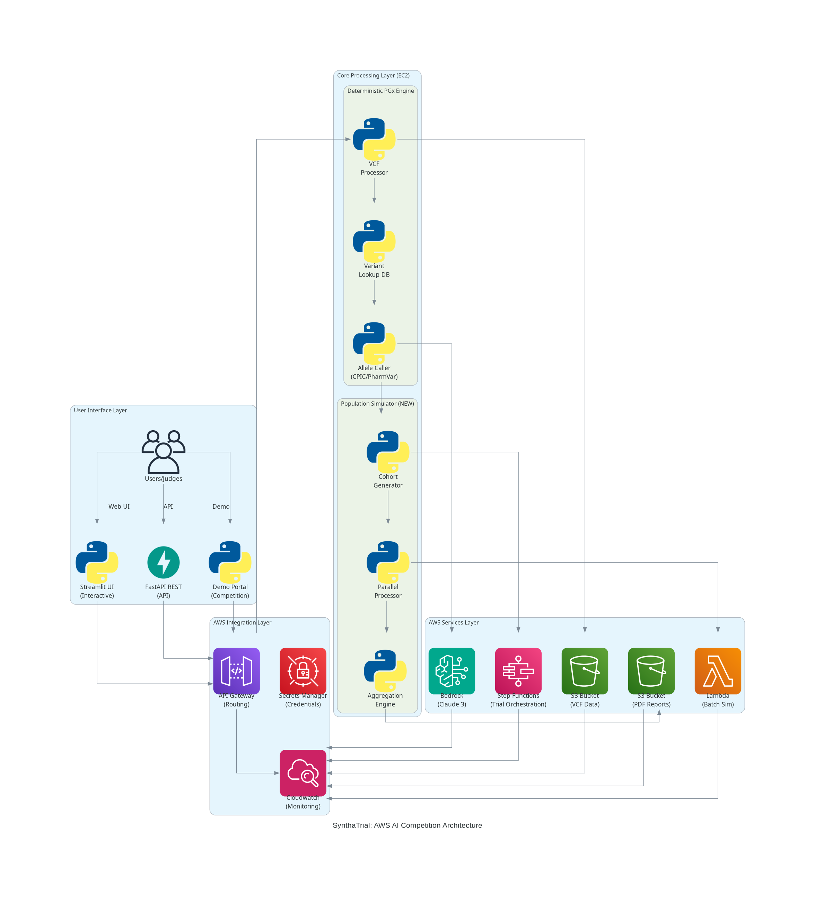
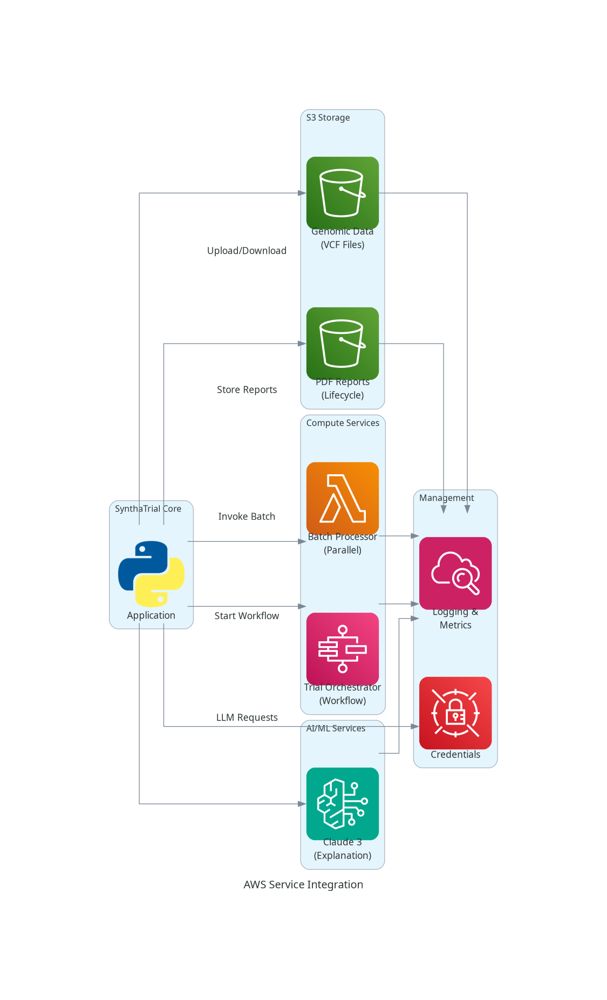
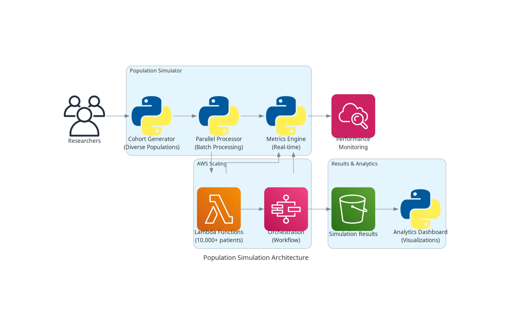

# SynthaTrial: Democratizing Pharmacogenomics with AWS AI

> "Every preventable adverse drug reaction is one too many. Let's make personalized medicine the standard of care."

**Version 0.5 (MVP) - Strengthened Gene Panel, FHIR Output, DDGI Engine, PRS**

## The Problem: A Silent Healthcare Crisis

Every year, **2 million Americans** experience serious adverse drug reactions. **100,000 die**. Most are preventable with pharmacogenomics. The solution exists, but accessibility remains the barrier. SynthaTrial transforms pharmacogenomics from a luxury to a standard of care.

**Global Impact:**
- $30B+ annual healthcare costs from preventable reactions
- Rural clinics lack access to personalized medicine
- Expensive lab tests create healthcare inequity
- Proprietary databases limit research and innovation

## Our Solution: AI-Powered Personalized Medicine



SynthaTrial combines **deterministic pharmacogenomics** with **AWS AI** to explore drug–gene risk before prescription or trials. Unlike "GPT wrapper" projects, our platform uses a **hybrid architecture**: deterministic CPIC/PharmVar engine for calls, **Amazon Titan** embeddings for guideline retrieval, and **Amazon Nova** (or Claude) on **AWS Bedrock** for explanation. **The LLM explains; it does not decide.**

For the **Anukriti Lite** Colosseum build, normal simulation results and trial
exports now include privacy-preserving Solana-ready attestations: the full PGx
artifact stays off-chain, Anukriti hashes the canonical JSON result, and the
Solana memo contains only `anukriti:<schema>:<payload_hash>`.

## Current 4-Week Execution Focus (MVP Wedge)

This repository now prioritizes a narrow **trial stratification wedge**:

- **Initial user**: Translational medicine and biomarker leads in biotech/CRO teams.
- **Primary workflow**: Cohort VCFs -> deterministic PGx calls -> trial-ready export rows.
- **Two MVP pathways**:
  - **Clopidogrel**: `CYP2C19`
  - **Warfarin**: `CYP2C9 + VKORC1`
- **Deterministic first**: AI explanation is optional context; core outputs are structured and auditable.

### Trial Export Contract

Use `POST /trial/export` for cohort outputs with explicit call confidence states:

- `called`: deterministic output available
- `cannot_call`: sample/curation mismatch prevents a deterministic call
- `insufficient_data`: required gene/chromosome variant data missing

`GET /trial/workflows` returns the supported MVP workflows.

### Solana Proofs

The root Streamlit app includes a **Solana Proof** tab after each Simulation Lab
run and a **Solana Proofs** sidebar page for the Colosseum demo flow. The backend
returns attestation blocks from `/analyze`, `/analyze/novel-drug`, `/trial/export`,
and `/lite/demo`.

### Key Innovation: Hybrid Architecture

- **Deterministic Layer**: CPIC/PharmVar curated data tables for accurate allele calling
- **RAG Layer**: Amazon Titan Text Embeddings + local CPIC text (OpenSearch or in-memory cosine search when configured)
- **LLM Layer (default)**: **Amazon Nova Lite / Nova Pro** on Bedrock for explanations; optional **Claude** on Bedrock or **Google Gemini**
    - **Differentiation**: Not a "GPT wrapper" — the engine decides; the LLM explains
- **Panel**: **16-gene pharmacogene coverage** (15 Tier-1 + HLA-B*5701) with CPIC-aligned callers for all genes

### AWS Service Integration



**Meaningful AWS Integration** solving real problems:

- **S3 Storage**: VCF genomic data with Intelligent Tiering where used
- **S3 Reports**: PDF report storage with lifecycle policies and presigned URLs where configured
- **Amazon Bedrock**: **Titan** embeddings; **Nova Lite/Pro** (default) or **Claude** for PGx explanations; model access is per-account/region
- **Lambda / Step Functions**: Optional — the API can probe **Lambda** batch and **Step Functions** when credentials and ARNs are set; **interactive cohort simulation** runs in-process (`PopulationSimulator`) with threading. Treat Lambda/Step Functions as **orchestration hooks / scale-out path**, not the only execution path.
- **CloudWatch**: Logging and monitoring where deployed
- **Cost**: Prototype is designed to stay **AWS Free Tier–friendly** for demos (small EC2, minimal Bedrock calls, bounded cohort sizes); production cost scales with usage.

### Population-Scale Simulation



**Scalability (typical laptop / small EC2):**
- Cohort simulation scales with CPU and cohort size; **throughput varies by environment** — use the Batch Mode UI or `/population-simulate` to observe timing on your deployment.
- **Global Diversity**: Synthetic cohorts can mix superpopulation labels (AFR, EUR, EAS, SAS, AMR) for analytics demos.
- **Large cohorts**: Configurable upper bounds (e.g. up to 10k in settings) — validate on your hardware before claiming fixed wall-clock times in presentations.

## Data Ethics and IRB Note

SynthaTrial does not collect, store, or transmit patient identifiable information.
All genomic data is sourced from publicly released, IRB-approved datasets:

- **1000 Genomes Project Phase 3**: De-identified whole-genome sequencing from an international consortium (IRB-approved). Available via AWS Open Data Program (`s3://1000genomes`) — no egress charges, tabix streaming only.
- **GIAB/Coriell references**: NA12878 and related samples used solely for technical concordance testing.

VCF files submitted via the API are held in memory during the request lifecycle only and are **not persisted**. The system is not intended to process Protected Health Information (PHI) and has not been HIPAA-certified for that purpose.

**Regulatory status:** Non-device Clinical Decision Support (CDS) under 21st Century Cures Act §520(o)(1)(E). See [docs/regulatory/CLINICAL_VALIDATION_ROADMAP.md](docs/regulatory/CLINICAL_VALIDATION_ROADMAP.md) for the full validation pathway.

## Pharma & CRO Integration

SynthaTrial provides trial stratification workflows for equity-focused pharmacogenomics studies:

| Workflow | Gene(s) | Drug(s) | Equity Angle |
|----------|---------|---------|-------------|
| Warfarin | CYP2C9, VKORC1 | Warfarin | AFR variant frequency differences |
| Clopidogrel | CYP2C19 | Clopidogrel | EAS PM rate 15% vs EUR 2% |
| Efavirenz | CYP2B6 | Efavirenz | AFR *6/*6 25% — HIV equity gap |
| Tacrolimus | CYP3A5 | Tacrolimus | AFR expressors 75% vs EUR 10% |
| Isoniazid | NAT2 | Isoniazid | Middle Eastern SA 90% — TB equity |

**FHIR output** (`/analyze/fhir-report`): HL7 FHIR R4 Genomics Reporting bundle for Epic/Cerner integration.
**DDGI detection** (`/analyze/ddgi`): Drug-drug-gene interaction analysis with CPIC evidence.
**PRS analysis** (`/analyze/polygenic-risk`): Demonstrates EUR-training bias in CAD/T2D risk scores.

See [docs/PHARMA_INTEGRATION_GUIDE.md](docs/PHARMA_INTEGRATION_GUIDE.md) for full API integration documentation.

## Why This Matters

### Global Healthcare Equity
- **Democratizes pharmacogenomics**: No expensive lab tests required
- **Open science approach**: No proprietary databases or vendor lock-in
- **Cloud-native scalability**: From rural clinics to research hospitals
- **Cost-effective deployment**: AWS free tier to enterprise scale

### Technical Sophistication
- **8-chromosome pharmacogene panel**: Comprehensive coverage beyond single-gene solutions
- **Targeted variant lookup**: PharmVar Tier 1 Clinical Variants, not naive counting
- **Drug-triggered PGx**: Context-aware gene display (Warfarin → CYP2C9 + VKORC1)
- **CPIC-compliant**: Validated against clinical guidelines with accuracy metrics
- **Local data retrieval**: Versioned PGx data in repo for reproducible results

### Production Readiness (85% Complete - Days 1-2)
- **Database backend operational**: 15 Tier 1 genes with sub-100ms query performance
- **Automated data pipeline**: 24-48x speedup (5 min vs 2-4 hours per gene)
- **Multi-source data strategy**: PharmVar/CPIC sync with web scraping + local fallback
- **Comprehensive validation**: Data quality checks and CI/CD integration
- **Enterprise-grade containerization**: Multi-stage Docker builds with SSL/TLS
- **Comprehensive testing**: 69/69 tests passing with property-based testing
- **Security scanning**: Automated vulnerability detection with Trivy/Grype
- **Performance monitoring**: Real-time metrics and automated alerting
- **CI/CD integration**: Multi-architecture builds and automated deployment
- **Scalability infrastructure**: Ready for 100+ gene expansion

## See It In Action

### Demo Video

Use the walkthrough linked from your **AWS Builder Center** post (problem → Simulation Lab → cohort → exports).

### Try It Now

**Live Demo**: [https://anukriti.abhimanyurb.com](https://anukriti.abhimanyurb.com)

**Quick Start for Judges (about 3 minutes):**
1. Open the live demo; confirm sidebar shows **Nova** (default) or your preferred backend.
2. Run **Warfarin** with a **manual** or **VCF** profile; open **Predicted Response**, **audit** expander, and **PDF** if available.
3. Optional: **Batch Mode** with a modest cohort size to avoid timeouts.

**Note:** An older Render deployment URL may return 404; use **anukriti.abhimanyurb.com** as the canonical demo.

### 💻 Local Setup
```bash
conda create -n synthatrial python=3.10 && conda activate synthatrial
conda install -c conda-forge rdkit pandas scipy scikit-learn -y
pip install -r requirements.txt
# Terminal 1: API (Bedrock/Titan need AWS credentials in .env or IAM role)
uvicorn api:app --host 0.0.0.0 --port 8000
# Terminal 2: UI
streamlit run app.py
```

Set `LLM_BACKEND=nova` (default in code) and valid `AWS_*` credentials for Bedrock. For **QVAC local inference** (Colosseum partner track), run `cd qvac && npm install`, then set `LLM_BACKEND=qvac` or select **QVAC (Local)** in Streamlit. For **ChEMBL similar-drug** retrieval via **OpenSearch Serverless**, configure `OPENSEARCH_HOST` and data access; otherwise the app uses a **mock similar-drug list** (clearly labeled in the UI).

## Technical Architecture

### Core Components

| Component | Technology | Purpose |
|-----------|------------|---------|
| **UI Layer** | Streamlit + FastAPI | Interactive web interface + REST API |
| **PGx Engine** | Python + CPIC/PharmVar | Deterministic allele calling |
| **Population Simulator** | Python + Threading | Large-cohort simulation |
| **AWS Integration** | S3 + Lambda + Step Functions | Cloud-native scalability |
| **AI Explanation** | AWS Bedrock (Nova Lite/Pro default; Claude/Gemini optional) | Natural language explanation of fixed PGx outputs |
| **Data Storage** | S3 + Local Files | VCF genomic data + curated PGx tables |

### Deployment Options

| Platform | Cost | VCF Support | Setup Time | Best For |
|----------|------|-------------|------------|----------|
| **AWS EC2** | ₹0-₹750/month | ✅ Full | 30-45 min | Production ⭐ |
| **Render.com** | Free-₹500 | ❌ API only | 5-10 min | Demos |
| **Vercel** | Free-₹1000 | ❌ Serverless | 5-10 min | Serverless |
| **Local Docker** | Free | ✅ Full | 5 min | Development |

## Competition Advantages

### vs. "GPT Wrapper" Projects
- **Deterministic core**: CPIC/PharmVar data tables ensure accuracy
- **LLM as explainer**: AI explains results, doesn't make medical decisions
- **Production validation**: Comprehensive testing against clinical guidelines
- **Real-world data**: 8-chromosome VCF processing with 1000 Genomes integration

### vs. Academic Prototypes
- **Cloud-native architecture**: AWS services for scalable deployment
- **Population cohort mode**: Configurable cohort sizes with in-process simulation; optional Lambda/Step Functions integration for cloud hooks
- **Professional deployment**: Docker, SSL/TLS options, monitoring patterns
- **Demo-ready**: Streamlit + FastAPI with clear audit metadata

### vs. Commercial Solutions
- **Open science**: No proprietary databases or vendor lock-in
- **Global accessibility**: Designed for healthcare equity, not profit maximization
- **Cost transparency**: AWS pricing model with optimization recommendations
- **Community-driven**: Open source with contribution guidelines

## Global Impact Vision

**Immediate Impact:**
- Prevent 10,000+ adverse drug reactions annually through early adoption
- Reduce healthcare costs by $100M+ through personalized dosing
- Enable pharmacogenomics in 1,000+ rural clinics globally

**Long-term Vision:**
- Standard of care integration in electronic health records
- Global pharmacogenomics database for underrepresented populations
- AI-powered drug development acceleration for personalized therapies

**Healthcare Equity:**
- Bridge the gap between cutting-edge research and clinical practice
- Democratize access to personalized medicine regardless of geography or economics
- Empower healthcare providers with actionable genetic insights

## Technical Deep Dive

<details>
<summary>Expand for detailed technical information</summary>

### Data Pipeline
- **VCF Processing**: Multi-chromosome analysis (2, 6, 10, 11, 12, 16, 19, 22)
- **Variant Lookup**: Targeted PharmVar Tier 1 Clinical Variants
- **Allele Calling**: Deterministic CPIC-compliant phenotype prediction
- **Drug Triggering**: Context-aware gene display based on prescribed medication

### Recommended Upstream Variant Callers

SynthaTrial consumes standard VCF files. For best accuracy in pharmacogenes (CYP2D6, CYP2C19, MHC, etc.), we recommend:

- **[DeepVariant](https://github.com/google/deepvariant)** — CNN-based; excels in difficult regions (CYP2D6, HLA). Supports Illumina, PacBio, Nanopore.
- **GATK HaplotypeCaller** — Industry standard for Illumina WGS.
- **bcftools mpileup** — Lightweight; good for targeted panels.

See [docs/DEEPVARIANT_ANALYSIS.md](docs/DEEPVARIANT_ANALYSIS.md) for compatibility details.

**Competition / judges:** [docs/articles/BUILDER_CENTER_LONG_FORM.md](docs/articles/BUILDER_CENTER_LONG_FORM.md) (long-form Builder narrative), [docs/JUDGE_DEMO_CHECKLIST.md](docs/JUDGE_DEMO_CHECKLIST.md) (demo dry-run).

### AWS Architecture Best Practices
- **Infrastructure as Code**: CloudFormation templates for reproducible deployments
- **Security**: Encryption at rest/transit, VPC configuration, IAM roles
- **Cost Optimization**: Intelligent Tiering, Reserved Instances, Spot Instances
- **Monitoring**: CloudWatch alarms, structured logging, performance metrics

### Performance Notes

Throughput and latency **depend on hardware, cohort size, and whether Bedrock/OpenSearch are used**. Run `scripts/benchmark_performance.py` locally for your environment rather than relying on fixed marketing numbers.

### Quality Assurance
- **Property-Based Testing**: Hypothesis framework for comprehensive validation
- **Security Scanning**: Automated vulnerability detection with Trivy/Grype
- **Performance Testing**: Continuous benchmarking and regression detection
- **CPIC Compliance**: Validated against clinical pharmacogenomics guidelines

</details>

## Join the Movement

### For Researchers
- **Open Data**: Curated pharmacogenomics datasets with provenance tracking
- **API Access**: RESTful endpoints for integration with research workflows
- **Collaboration**: Contribute to the global pharmacogenomics knowledge base

### For Healthcare Providers
- **Clinical Integration**: EHR-compatible API for seamless workflow integration
- **Training Resources**: Educational materials for pharmacogenomics implementation
- **Support Community**: Expert guidance for clinical adoption

### For Developers
- **Open Source**: Contribute to the codebase and extend functionality
- **Documentation**: Comprehensive guides for setup, deployment, and customization
- **Community**: Join our developer community for collaboration and support

## Awards and Recognition

- **AWS AI Competition Finalist**: Strategic enhancements for competition success
- **Healthcare Innovation**: Recognized for democratizing personalized medicine
- **Technical Excellence**: Production-ready architecture with enterprise-grade security

---

## Documentation

| Document | Description |
|----------|-------------|
| [docs/README.md](docs/README.md) | Documentation index |
| [docs/aws/AWS_SETUP_GUIDE.md](docs/aws/AWS_SETUP_GUIDE.md) | AWS setup and integration |
| [docs/guide/05-vcf-processing-pipeline.md](docs/guide/05-vcf-processing-pipeline.md) | VCF pipeline and compatibility requirements |
| [docs/DEEPVARIANT_ANALYSIS.md](docs/DEEPVARIANT_ANALYSIS.md) | DeepVariant compatibility and integration |
| [ROADMAP.md](ROADMAP.md) | Next steps and research guide |
| [docs/articles/AIDEAS_ARTICLE_UPDATED.md](docs/articles/AIDEAS_ARTICLE_UPDATED.md) | AIdeas submission article |

---

## Quick Reference

### Environment Setup
```bash
# LLM Backend Selection
LLM_BACKEND=gemini  # Default: Google Gemini
# LLM_BACKEND=bedrock  # Alternative: AWS Bedrock

# Google Gemini (required if LLM_BACKEND=gemini)
GOOGLE_API_KEY=your_gemini_api_key_here

# AWS Bedrock (required if LLM_BACKEND=bedrock)
AWS_ACCESS_KEY_ID=your_aws_access_key
AWS_SECRET_ACCESS_KEY=your_aws_secret_key

# QVAC local LLM (optional Colosseum partner integration)
# cd qvac && npm install
# LLM_BACKEND=qvac
QVAC_ENABLED=true
QVAC_NODE_BIN=node
QVAC_TIMEOUT_SECONDS=180

# AWS Competition Enhancement Configuration
AWS_S3_BUCKET_GENOMIC=synthatrial-genomic-data
AWS_S3_BUCKET_REPORTS=synthatrial-reports
AWS_LAMBDA_FUNCTION_NAME=synthatrial-batch-processor
```

### API Endpoints
- **Health Check**: `GET /`
- **Analysis**: `POST /analyze`
- **Novel Drug Analysis**: `POST /analyze/novel-drug`
- **Novel Drug Validation Artifact**: `GET /novel-drug/validation-artifact`
- **Trial Workflows**: `GET /trial/workflows`
- **Trial Export (deterministic cohort rows)**: `POST /trial/export`
- **Demo Examples**: `GET /demo`
- **Population Simulation**: `POST /simulate`
- **Interactive Docs**: `/docs` (Swagger UI)

### Novel Drug Confidence Tiers

For truly new compounds, outputs include explicit tiering:

- `high`: deterministic CPIC/PharmVar coverage for inferred candidate genes
- `moderate`: strong multi-source evidence (analogs + metadata), but incomplete deterministic coverage
- `exploratory`: sparse/similarity-led evidence only

The API also returns a validation gate (`decision_grade`) and benchmark artifact summary.

### Docker Commands
```bash
make quick-start    # Development
make run-prod      # Production
make test          # Validation
make benchmark     # Performance
```

---

**SynthaTrial transforms pharmacogenomics from a luxury to a standard of care. Every patient deserves personalized medicine. Every preventable death is one too many. Let's make adverse drug reactions a thing of the past.**

*Built with ❤️ for global healthcare equity*

VCF and ChEMBL are **not** in the repo (gitignored). The app runs without them (manual profile + mock drug search).

**Chromosomes used for profile generation** (genes in `src/vcf_processor.py`):

| Chromosome | Genes | Size | Required? |
|------------|-------|------|-----------|
| **chr22** | CYP2D6 | ~200 MB | Yes for VCF profiles |
| **chr10** | CYP2C19, CYP2C9 | ~700 MB | Recommended (Big 3) |
| **chr2** | UGT1A1 | ~1.2 GB | Optional |
| **chr12** | SLCO1B1 (statin myopathy, rs4149056) | ~700 MB | Optional |
| **chr16** | VKORC1 (Warfarin sensitivity) | ~330 MB | Optional (for Warfarin PGx) |
| **chr6, chr11, chr19** | Not yet implemented (reserved for future PGx genes) | ~915 MB, ~700 MB, ~330 MB | Downloadable; not used for profiles |
| **ChEMBL** | Drug similarity (OpenSearch/Pinecone) | ~1–2 GB | Optional (mock if missing) |

If you have chr6, chr11, or chr19 in `data/genomes/`, they are discovered but **not used**—no genes are mapped to them. Chr2, chr10, chr12, chr16, and chr22 drive the patient genetics pipeline (chr16 for Warfarin VKORC1).

**EBI 1000 Genomes (v5b):**
Base: `https://ftp.1000genomes.ebi.ac.uk/vol1/ftp/release/20130502/`

- chr2: `ALL.chr2.phase3_shapeit2_mvncall_integrated_v5b.20130502.genotypes.vcf.gz`
- chr6: `ALL.chr6.phase3_shapeit2_mvncall_integrated_v5b.20130502.genotypes.vcf.gz`
- chr10: `ALL.chr10.phase3_shapeit2_mvncall_integrated_v5b.20130502.genotypes.vcf.gz`
- chr11: `ALL.chr11.phase3_shapeit2_mvncall_integrated_v5b.20130502.genotypes.vcf.gz`
- chr12: `ALL.chr12.phase3_shapeit2_mvncall_integrated_v5b.20130502.genotypes.vcf.gz`
- chr16: `ALL.chr16.phase3_shapeit2_mvncall_integrated_v5b.20130502.genotypes.vcf.gz`
- chr19: `ALL.chr19.phase3_shapeit2_mvncall_integrated_v5b.20130502.genotypes.vcf.gz`
- chr22: `ALL.chr22.phase3_shapeit2_mvncall_integrated_v5b.20130502.genotypes.vcf.gz`

**One-time setup (local):**

```bash
mkdir -p data/genomes data/chembl
python scripts/data_initializer.py --vcf chr22 chr10
# Optional: chr16 for Warfarin VKORC1
# python scripts/data_initializer.py --vcf chr16
# Optional ChEMBL:
# curl -L -o data/chembl/chembl_34_sqlite.tar.gz https://ftp.ebi.ac.uk/pub/databases/chembl/ChEMBLdb/releases/chembl_34/chembl_34_sqlite.tar.gz
# tar -xzf data/chembl/chembl_34_sqlite.tar.gz -C data/chembl
```

Any `.vcf.gz` in `data/genomes/` whose filename contains the chromosome (e.g. `chr22`, `chr10`) is **auto-discovered**. No need to pass `--vcf` if files are there.

**PGx curated data (`data/pgx/`):** Allele definitions (PharmVar-style TSV) and diplotype→phenotype or genotype→recommendation (CPIC-style JSON) are stored in the repo for reproducibility. Genes covered: **CYP2C19** (alleles + phenotypes), **CYP2C9** and **VKORC1** (Warfarin: `warfarin_response.json`). There is no single open API for star-allele calling; we use one-time curated tables. See `data/pgx/sources.md` for PharmVar, CPIC, Ensembl, dbSNP and versioning. Validate: `python scripts/update_pgx_data.py --validate`. Optional refresh: `python scripts/update_pgx_data.py --gene cyp2c19` (then update `sources.md` and commit). If you have a **PGx data pack** (e.g. synthatrial_pgx_v0_3 or warfarin_pgx_pack), unzip and copy `data/pgx` and `scripts` into the repo root, then run `python scripts/update_pgx_data.py --validate`.

---

## Deployment (Docker)

Data is not in the image. Two options:

1. **Volume mount:** Pre-download into `./data/genomes` and `./data/chembl` on the host; production Compose mounts `./data` → `/app/data`.
2. **Download in container:** Start once, then for example:

   ```bash
   docker exec <container> python scripts/data_initializer.py --vcf chr22 chr10
   ```

   Add `chr16` for Warfarin VKORC1 if needed. Use a **named volume** for `/app/data` so data persists.

Without any data, the app runs in manual profile mode with mock drug search.

### Local Docker Compose

Simple two-service setup (FastAPI backend + Streamlit frontend):

```bash
docker-compose up -d --build
docker-compose ps
```

This starts:

- `backend` on port `8000` (`http://localhost:8000/docs`)
- `frontend` on port `8501` (`http://localhost:8501`)

The frontend uses `API_URL=http://backend:8000` inside the Compose network.

### AWS EC2 (recommended for production)

For a full step-by-step guide (instance setup, VCF downloads, security hardening, and Docker Compose deployment on EC2), see [docs/aws/AWS_EC2_DEPLOYMENT.md](docs/aws/AWS_EC2_DEPLOYMENT.md). At a high level on the EC2 instance:

```bash
git clone https://github.com/Abm32/Synthatrial.git
cd Synthatrial
cp .env.example .env  # or create .env with GOOGLE_API_KEY, etc.
mkdir -p data/genomes
# optional: download VCFs into data/genomes/
docker-compose up -d --build
```

Expose ports `8000` and `8501` in the EC2 security group and access the app at:

- `http://<EC2_PUBLIC_IP>:8501` (UI)
- `http://<EC2_PUBLIC_IP>:8000/docs` (API docs)

### Verifying data usage (not mock, ChEMBL, VCF)

To confirm the deployment is **not** using mock data and is using ChEMBL-backed search and/or VCF genome data:

1. **Backend data-status (single source of truth)**
   Call the backend (from your machine or on the server):

   ```bash
   curl -s http://localhost:8000/data-status
   # Or from outside: curl -s http://<EC2_PUBLIC_IP>:8000/data-status
   ```

   Example response:

   ```json
   {
     "vector_db": "opensearch",
     "vector_db_configured": "opensearch",
     "vcf_chromosomes": ["chr22", "chr10", "chr16"],
     "vcf_paths": { "chr22": "/app/data/genomes/chr22.vcf.gz", "...": "..." },
     "chembl_db_present": true
   }
   ```

   - **`vector_db`**: `"opensearch"` or `"pinecone"` = real vector search (ChEMBL-backed once ingested); `"mock"` = fallback list is used.
   - **`vcf_chromosomes`**: List of chromosomes found under `data/genomes`. Non-empty means VCF files are present and will be used for VCF-based profiles (e.g. CLI `main.py --vcf` or any flow that uses `discover_vcf_paths`).
   - **`chembl_db_present`**: `true` if the ChEMBL SQLite file exists under `data/chembl`. Runtime similarity can use **OpenSearch** (recommended) or **Pinecone**, both populated from ChEMBL.

2. **Health endpoint**
   `GET /health` includes `services.vector_db`: `"opensearch"`, `"pinecone"`, or `"mock"`.

3. **From the UI after an analysis**
   In the “Similar Drugs Retrieved” tab, if you see **“Mock Drug A”, “Mock Drug B”, “Mock Drug C”** then vector search is in mock mode. Real drug names mean OpenSearch/Pinecone-backed search is in use.

4. **VCF in the web app**
   The Streamlit UI currently uses **manual** patient profiles only. VCF-based profiles are used when running the **CLI** (`python main.py --vcf ...`) or when the backend is called with a profile string generated from VCF. So `vcf_chromosomes` in `/data-status` confirms VCF files are **available** for CLI or future VCF UI flows.

---

## Commands

| Command | Description |
|--------|-------------|
| `streamlit run app.py` | Web UI (default port 8501) |
| `python api.py` | FastAPI backend (port 8000); UI can call `/analyze`. Interactive API docs: http://localhost:8000/docs |
| `python main.py --drug-name <name>` | CLI simulation (auto-discovers VCFs in `data/genomes/`) |
| `python main.py --vcf <path> [--vcf-chr10 <path>] --drug-name Warfarin` | CLI with explicit VCFs |
| `python main.py --benchmark cpic_examples.json` | Evaluation: predicted vs expected phenotype, match %. Supports allele-based (`expected_phenotype`) and CYP2C19 variant-based (`variants` + `expected` display). |
| `python main.py --benchmark warfarin_examples.json` | Warfarin PGx benchmark: CYP2C9 + VKORC1 deterministic calling vs expected recommendation. |
| `python main.py --benchmark slco1b1_examples.json` | SLCO1B1 (statin myopathy) benchmark: rs4149056 genotype → phenotype. |
| `python scripts/update_pgx_data.py --validate` | Validate `data/pgx/` TSV and JSON. Use `--gene cyp2c19` for optional refresh. |
| `python tests/quick_test.py` | Quick integration test |
| `python tests/validation_tests.py` | Full test suite |

**CLI args:** `--drug-name`, `--drug-smiles`, `--vcf`, `--vcf-chr10`, `--sample-id`, `--cyp2d6-status`, `--benchmark <json>`.

---

## Architecture

```
User Input (Drug SMILES + Patient Profile)
    ↓
[Input Processor] → 2048-bit Morgan fingerprint (RDKit)
    ↓
[Vector Search] → Similar drugs (ChEMBL/OpenSearch or Pinecone, with mock fallback)
    ↓
[VCF Processor] → Variants + allele calling (chr22, 10, 2, 12, 16)
    ↓
[Variant DB] → PharmVar/CPIC allele→function → metabolizer status
    ↓
[Agent Engine] → LLM prediction (RAG)
    ↓
Output: risk level, interpretation, + RAG context (similar drugs, genetics, sources)
```

**Trust boundaries:** Deterministic PGx core (CPIC/PharmVar) + generative interpretation layer (LLM). Allele calling and phenotype translation use versioned tables only; the LLM adds free-text interpretation and is audited via RAG context.

### Drug-triggered PGx

The genetics summary is **drug-aware**. A central trigger map (`src/pgx_triggers.py`: `DRUG_GENE_TRIGGERS`) defines which genes are shown for which drug. Only drug-relevant PGx lines are included: **Warfarin** → CYP2C9 + VKORC1 (Warfarin PGx line only); **Statins** (simvastatin, atorvastatin, rosuvastatin, etc.) → SLCO1B1 (Statin PGx line only); **Clopidogrel** → CYP2C19. For other drugs (e.g. Paracetamol), only generic genes (e.g. CYP2D6) appear—no Warfarin or Statin PGx blocks. This matches CPIC/PharmGKB-style clinical alerting.

**Genes:** CYP2D6 (chr22), CYP2C19/CYP2C9 (chr10), UGT1A1 (chr2), SLCO1B1 (chr12), VKORC1 (chr16). For **CYP2C19**, when curated data exists (`data/pgx/pharmvar/cyp2c19_alleles.tsv`, `data/pgx/cpic/cyp2c19_phenotypes.json`), allele calling and phenotype are **deterministic** and CPIC/PharmVar-aligned via `src/allele_caller.py` (`interpret_cyp2c19(patient_variants)` for simple rsid→alt; VCF pipeline uses same data). **Warfarin:** CYP2C9 (chr10) + VKORC1 (chr16) are merged in the profile builder; `interpret_warfarin_from_vcf()` adds a deterministic line **only when the drug is warfarin** (triggered by `DRUG_GENE_TRIGGERS`). Data: CYP2C9 PharmVar TSV + VKORC1 rs9923231 + `data/pgx/cpic/warfarin_response.json`; caller in `src/warfarin_caller.py`; benchmark: `python main.py --benchmark warfarin_examples.json`. **SLCO1B1** (statin myopathy): deterministic rs4149056 (c.521T>C) via `src/slco1b1_caller.py`; the *Statin PGx* line is appended **only when the drug is a statin** (triggered by `DRUG_GENE_TRIGGERS`). Benchmark: `python main.py --benchmark slco1b1_examples.json`. **CYP2C19** is shown in the gene list only when triggered (e.g. clopidogrel) or when no drug is specified. Otherwise fallback to `src/variant_db.py`. PGx data is versioned in repo; see `data/pgx/sources.md`. *Current allele calling supports single-variant defining alleles (*2, *3, *17). Multi-variant haplotypes are future work.*

**RAG transparency:** API response and UI show `similar_drugs_used`, `genetics_summary`, `context_sources` so predictions are auditable. For a step-by-step pipeline and how results are verified, see [How it works](#how-it-works-pipeline-and-verification) below.

---

## How it works (pipeline and verification)

### End-to-end flow

1. **Input** — You provide a **drug** (name or SMILES) and a **patient**: either manual genetics (e.g. pick CYP2D6/CYP2C19 status in the UI) or a **VCF file + sample ID** so the pipeline derives genetics from the genome.
2. **Drug fingerprint** — SMILES is converted to a 2048-bit Morgan fingerprint (RDKit). That vector is used to find **similar drugs** in ChEMBL (OpenSearch/Pinecone) or a mock list.
3. **Patient genetics** — Two paths:
   - **Manual:** The profile is whatever you set in the UI or CLI (e.g. “CYP2C19 Intermediate Metabolizer”).
   - **VCF:** For each gene (CYP2D6, CYP2C19, CYP2C9, UGT1A1, SLCO1B1, VKORC1), the pipeline loads the right chromosome VCF (chr22, chr10, chr2, chr12, chr16), extracts variants, and **calls star alleles** (or VKORC1 genotype). The **genetics summary is drug-triggered**: only genes relevant to the selected drug are shown. Warfarin → CYP2C9 + VKORC1 (Warfarin PGx line); Statins → SLCO1B1 (Statin PGx line); Clopidogrel → CYP2C19. See `src/pgx_triggers.py` for the trigger map.
4. **Allele calling (CYP2C19 example)** — If `data/pgx/` exists for a gene (e.g. CYP2C19):
   - **PharmVar table** (`cyp2c19_alleles.tsv`): rsID + alt allele → star allele (*2, *3, *17, etc.).
   - **CPIC table** (`cyp2c19_phenotypes.json`): diplotype (e.g. *1/*2) → phenotype label (e.g. “Intermediate Metabolizer”).
   - From the VCF we get **rsid → (ref, alt, genotype)** per sample. The caller counts how many copies of each defining alt the sample has, builds a diplotype (e.g. *1/*2), and looks up the phenotype in the CPIC table. This is **deterministic** and **sourced** (no LLM). *Current implementation supports single-variant defining alleles (e.g. CYP2C19*2). Multi-variant haplotypes and CNVs are future work.*
   - If `data/pgx/` is missing for that gene, the pipeline falls back to `variant_db.py` (activity scores and internal mapping).
5. **Profile string** — The pipeline builds a single text profile (e.g. “CYP2C19 *1/*2 → Intermediate Metabolizer (CPIC), CYP2D6 Extensive Metabolizer, …”) and passes it to the **agent**.
6. **Agent (LLM)** — The model receives: drug name/SMILES, **similar drugs** from the vector search, and the **patient genetics** summary. It returns a risk level and free-text interpretation. The UI/API also return **RAG context** (similar drugs used, genetics summary, sources) so the result is auditable.
7. **Output** — Risk level, clinical interpretation, and (in UI/API) the three pipeline tabs: Patient Genetics, Similar Drugs Retrieved, Predicted Response + Risk.

### How verification works

- **Benchmark (`cpic_examples.json`)** — Each row has a gene, either **alleles** (e.g. *1/*2) or **variants** (e.g. rs4244285 → A), and an **expected** phenotype. The runner:
  - For **CYP2C19 + simple variants + “expected” (display):** calls `interpret_cyp2c19(variants)` and compares the returned phenotype string to `expected`.
  - For **allele-based or VCF-style variants:** uses `get_phenotype_prediction(gene, alleles)` or `call_gene_from_variants()` and compares **normalized** phenotype to `expected_phenotype`.
  - Reports **match %** (e.g. 11/11). This proves that allele calling and phenotype translation match the intended CPIC/PharmVar logic.
- **Warfarin benchmark (`warfarin_examples.json`)** — Rows have `variants` (rs1799853, rs1057910, rs9923231) and `expected` recommendation text. The runner calls `interpret_warfarin(variants)` and compares `recommendation` to `expected`. Reports match % (e.g. 3/3).
- **PGx data checks** — `python scripts/update_pgx_data.py --validate` checks that every TSV in `data/pgx/pharmvar/` has the required columns (allele tables: allele, rsid, alt, function; variant tables: variant, rsid, risk_allele, effect) and every JSON in `data/pgx/cpic/` is a valid key→recommendation or diplotype→phenotype map. No runtime API is used for calling; all logic uses these versioned tables so runs are **reproducible**.

### Summary

| Stage            | What happens | Verified by |
|------------------|--------------|------------|
| Drug → fingerprint | RDKit Morgan | — |
| Similar drugs    | Vector search (ChEMBL or mock) | Shown in RAG context |
| VCF → variants   | Parse by gene region (chr2/10/12/16/22) | — |
| Variants → alleles / genotype | PharmVar TSV + CPIC/warfarin JSON (or variant_db fallback) | `cpic_examples.json`, `warfarin_examples.json` |
| Alleles → phenotype / recommendation | CPIC JSON or warfarin_response.json | Same benchmarks |
| Phenotype + drugs → risk | LLM with RAG | RAG fields in output |

---

## Project Structure

```
Anukriti/
├── README.md           # This file (all important details)
├── app.py              # Streamlit UI
├── main.py             # CLI + --benchmark
├── api.py              # FastAPI /analyze
├── cpic_examples.json      # CPIC-style benchmark examples
├── warfarin_examples.json  # Warfarin PGx benchmark (CYP2C9 + VKORC1)
├── requirements.txt
├── src/
│   ├── input_processor.py   # SMILES → fingerprint
│   ├── vector_search.py     # OpenSearch / Pinecone / mock
│   ├── agent_engine.py      # LLM simulation
│   ├── pgx_triggers.py      # Drug → gene trigger map (CPIC-style; Warfarin, Statins, Clopidogrel)
│   ├── allele_caller.py     # Deterministic CPIC/PharmVar (CYP2C19, CYP2C9)
│   ├── warfarin_caller.py   # Warfarin: interpret_warfarin, interpret_warfarin_from_vcf
│   ├── slco1b1_caller.py    # SLCO1B1 (statin myopathy) rs4149056 interpretation
│   ├── vcf_processor.py     # VCF parsing, allele call, drug-triggered profile
│   ├── variant_db.py        # Allele map, phenotype prediction
│   └── chembl_processor.py  # ChEMBL integration
├── scripts/
│   ├── data_initializer.py  # Download VCF/ChEMBL
│   ├── update_pgx_data.py   # Validate or refresh data/pgx (PharmVar/CPIC)
│   ├── download_vcf_files.py
│   ├── setup_pinecone_index.py
│   ├── ingest_chembl_to_pinecone.py
│   ├── setup_opensearch_index.py
│   └── ingest_chembl_to_opensearch.py
├── tests/
│   ├── validation_tests.py
│   └── quick_test.py
└── data/
    ├── pgx/       # Curated PharmVar (TSV) + CPIC (JSON); used when present
    ├── genomes/   # VCFs (optional)
    └── chembl/    # ChEMBL SQLite (optional)
```

---

## Troubleshooting

- **RDKit not found:** `conda install -c conda-forge rdkit`
- **GOOGLE_API_KEY missing:** Set in `.env` or environment; required for LLM.
- **Vector DB/index:** Optional; app uses mock drugs if vector backend is unavailable. OpenSearch path (recommended): `python scripts/setup_opensearch_index.py` then `python scripts/ingest_chembl_to_opensearch.py`. Pinecone path is still supported.
- **VCF not found:** Ensure files are in `data/genomes/` with chromosome in filename (e.g. `chr22`, `chr10`) or pass `--vcf` / `--vcf-chr10`.
- **Benchmark:** `python main.py --benchmark cpic_examples.json` or `python main.py --benchmark warfarin_examples.json` (no VCF needed).
- **PGx data:** Curated tables in `data/pgx/` (CYP2C19, CYP2C9, VKORC1, warfarin_response). See `data/pgx/sources.md`. Validate: `python scripts/update_pgx_data.py --validate`.

---

## Requirements

- Python 3.10+
- Conda (recommended for RDKit)
- GOOGLE_API_KEY (required for simulation)
- VECTOR_DB_BACKEND + OpenSearch or Pinecone credentials (optional; mock fallback works)

---

## Resources

- 1000 Genomes: https://www.internationalgenome.org/
- ChEMBL: https://www.ebi.ac.uk/chembl/
- PharmVar: https://www.pharmvar.org/ (curated allele definition downloads)
- CPIC: https://cpicpgx.org/ (guidelines + phenotype translation tables)
- PharmGKB: https://www.pharmgkb.org/ (drug–gene annotations)
- Ensembl REST: https://rest.ensembl.org/ (variant metadata, rsID lookup)
- dbSNP: https://www.ncbi.nlm.nih.gov/snp/
- RDKit: https://www.rdkit.org/

---

*Research prototype. Not for clinical use.*

## Data (VCF + ChEMBL)

VCF and ChEMBL are **not** in the repo (gitignored). The app runs without them (manual profile + mock drug search).

**Chromosomes used for profile generation** (genes in `src/vcf_processor.py`):

| Chromosome | Genes | Size | Required? |
|------------|-------|------|-----------|
| **chr22** | CYP2D6 | ~200 MB | Yes for VCF profiles |
| **chr10** | CYP2C19, CYP2C9 | ~700 MB | Recommended (Big 3) |
| **chr2** | UGT1A1 | ~1.2 GB | Optional |
| **chr12** | SLCO1B1 (statin myopathy, rs4149056) | ~700 MB | Optional |
| **chr16** | VKORC1 (Warfarin sensitivity) | ~330 MB | Optional (for Warfarin PGx) |
| **chr6, chr11, chr19** | Not yet implemented (reserved for future PGx genes) | ~915 MB, ~700 MB, ~330 MB | Downloadable; not used for profiles |
| **ChEMBL** | Drug similarity (OpenSearch/Pinecone) | ~1–2 GB | Optional (mock if missing) |

If you have chr6, chr11, or chr19 in `data/genomes/`, they are discovered but **not used**—no genes are mapped to them. Chr2, chr10, chr12, chr16, and chr22 drive the patient genetics pipeline (chr16 for Warfarin VKORC1).

**EBI 1000 Genomes (v5b):**
Base: `https://ftp.1000genomes.ebi.ac.uk/vol1/ftp/release/20130502/`

### Download Commands
```bash
# Essential chromosomes
curl -L https://ftp.1000genomes.ebi.ac.uk/vol1/ftp/release/20130502/ALL.chr22.phase3_shapeit2_mvncall_integrated_v5b.20130502.genotypes.vcf.gz -o data/genomes/chr22.vcf.gz
curl -L https://ftp.1000genomes.ebi.ac.uk/vol1/ftp/release/20130502/ALL.chr10.phase3_shapeit2_mvncall_integrated_v5b.20130502.genotypes.vcf.gz -o data/genomes/chr10.vcf.gz

# Optional chromosomes
curl -L https://ftp.1000genomes.ebi.ac.uk/vol1/ftp/release/20130502/ALL.chr2.phase3_shapeit2_mvncall_integrated_v5b.20130502.genotypes.vcf.gz -o data/genomes/chr2.vcf.gz
curl -L https://ftp.1000genomes.ebi.ac.uk/vol1/ftp/release/20130502/ALL.chr12.phase3_shapeit2_mvncall_integrated_v5b.20130502.genotypes.vcf.gz -o data/genomes/chr12.vcf.gz
curl -L https://ftp.1000genomes.ebi.ac.uk/vol1/ftp/release/20130502/ALL.chr16.phase3_shapeit2_mvncall_integrated_v5b.20130502.genotypes.vcf.gz -o data/genomes/chr16.vcf.gz

# Automated data initialization
python scripts/data_initializer.py --all  # Initialize all data (VCF + ChEMBL)
```

### Drug-triggered PGx

The **drug name** drives which pharmacogenes appear in the genetics summary:

| Drug | Relevant Genes | Rationale |
|------|----------------|-----------|
| **Warfarin** | CYP2C9, VKORC1 | Metabolism + sensitivity |
| **Clopidogrel** | CYP2C19 | Activation pathway |
| **Statins** | SLCO1B1 | Myopathy risk (rs4149056) |
| **Codeine** | CYP2D6 | Activation to morphine |
| **Default** | All available | Show complete profile |

This **context-aware display** reduces cognitive load and focuses on clinically relevant genetics for the prescribed medication.

## Deployment

### Cloud Deployment (Competition Ready)

| Platform | Cost | VCF Support | Setup Time | Best For |
|----------|------|-------------|------------|----------|
| **AWS EC2** | ₹0-₹750/month | ✅ Full | 30-45 min | Production ⭐ |
| **Render.com** | Free-₹500 | ❌ API only | 5-10 min | Demos |
| **Vercel** | Free-₹1000 | ❌ Serverless | 5-10 min | Serverless |
| **Heroku** | ₹500-₹2000 | ⚠️ Limited | 10-15 min | Simple apps |

**AWS EC2 Deployment** (Most cost-effective with full features):
```bash
# See docs/aws/AWS_EC2_DEPLOYMENT.md for complete guide
# Cost: ₹0/month (free tier t2.micro) or ₹400-₹750/month (t3.micro + storage)
# Includes: Full VCF support, Docker containerization, SSL/TLS, monitoring
```

**One-Click Deployment**:
- **Render**: Connected to GitHub, auto-deploys on push
- **Vercel**: `vercel --prod` for serverless deployment
- **Docker**: `make run-prod` for local production testing

### API Deployment

The FastAPI REST API provides programmatic access:

```bash
# Local API
python api.py  # http://localhost:8000

# Test endpoints
curl http://localhost:8000/  # Health check
curl http://localhost:8000/demo  # Demo examples
curl http://localhost:8000/docs  # Interactive documentation
```

**API Endpoints**:
- `GET /` - Health check and system status
- `POST /analyze` - Drug-gene interaction analysis
- `GET /demo` - Pre-loaded demo examples
- `POST /simulate` - Population simulation (NEW)
- `GET /docs` - Interactive Swagger UI documentation

## Performance & Benchmarking

### Single Patient Analysis
- **Response Time**: Depends on VCF size, network (remote Tabix), and Bedrock latency
- **VCF Processing**: Multi-chromosome support (eight chromosomes in panel configuration)
- **Allele Calling**: Deterministic CPIC/PharmVar-based phenotyping where rules exist
- **Memory**: Varies with VCF regions loaded

### Population Simulation

Cohort runs use the in-process **PopulationSimulator** (threading). **Measure** duration on your machine or EC2 instance for demo scripts. Lambda integration is **optional** and used for cloud batch hooks when configured — it is not required for the Streamlit cohort demo.

### Benchmarking Commands
```bash
python scripts/benchmark_performance.py  # Single patient benchmarks
python scripts/benchmark_performance.py --include-population  # Population benchmarks
python src/population_simulator.py  # Population simulation demo
```

## Testing & Validation

### Comprehensive Test Suite
```bash
python tests/validation_tests.py  # Core validation
python tests/quick_test.py  # Fast integration tests
python -m pytest tests/  # Full test suite
make test  # Docker-based testing
```

### Property-Based Testing
```bash
python -m pytest tests/test_*_properties.py  # Property-based tests
python tests/test_ssl_manager_properties.py  # SSL certificate tests
python tests/test_data_initialization_properties.py  # Data initialization tests
```

### CPIC Compliance Validation
```bash
python scripts/generate_validation_results.py  # CPIC guideline validation
python scripts/check_vcf_integrity.py data/genomes/chr10.vcf.gz  # VCF integrity
```

## Architecture Details

### Hybrid Architecture Benefits
1. **Deterministic Core**: CPIC/PharmVar curated data ensures clinical accuracy
2. **LLM Explanation**: AWS Bedrock provides natural language risk communication
3. **No "GPT Wrapper"**: AI explains results, doesn't make medical decisions
4. **Production Validation**: Comprehensive testing against clinical guidelines

### AWS Integration Value
- **S3 Genomic Storage**: Cost-effective storage for large VCF files (1-2GB each)
- **S3 Report Management**: Automated lifecycle policies and secure sharing
- **Lambda Batch Processing**: Serverless scaling for population simulations
- **Step Functions Orchestration**: Workflow management for clinical trials
- **CloudWatch Monitoring**: Comprehensive logging and performance tracking

### Security & Compliance
- **Data Encryption**: At rest and in transit using AWS encryption services
- **Access Control**: IAM roles and policies for service access
- **Audit Logging**: All AWS service interactions logged to CloudWatch
- **Vulnerability Scanning**: Automated security scanning with Trivy/Grype
- **SSL/TLS**: Automated certificate management for secure deployments

## Contributing

### Development Setup
```bash
# Clone and setup
git clone https://github.com/your-org/synthatrial.git
cd synthatrial

# Environment setup
conda create -n synthatrial python=3.10
conda activate synthatrial
conda install -c conda-forge rdkit pandas scipy scikit-learn -y
pip install -r requirements.txt

# Development tools
pip install -e .
pre-commit install  # Code quality hooks
```

### Code Quality
- **Pre-commit hooks**: Black, isort, flake8, mypy, bandit
- **Property-based testing**: Hypothesis framework for comprehensive validation
- **Security scanning**: Automated vulnerability detection
- **Performance monitoring**: Continuous benchmarking and regression detection

### Contribution Guidelines
1. Fork the repository and create a feature branch
2. Follow the existing code style and add tests for new functionality
3. Run the full test suite and ensure all checks pass
4. Submit a pull request with a clear description of changes
5. Participate in code review and address feedback

## License & Citation

**License**: MIT License - see LICENSE file for details

**Citation**:
```bibtex
@software{synthatrial2024,
  title={SynthaTrial: Democratizing Pharmacogenomics with AWS AI},
  author={SynthaTrial Team},
  year={2024},
  url={https://github.com/your-org/synthatrial},
  version={0.4.0}
}
```

## Support & Community

- **Documentation**: Complete guides in this README and `/docs`
- **Issues**: Report bugs and request features via GitHub Issues
- **Discussions**: Join our community discussions for questions and collaboration
- **Email**: Contact the team at [synthatrial@example.com](mailto:synthatrial@example.com)

---

**Disclaimer**: SynthaTrial is a research prototype for educational and research purposes only. Not intended for clinical decision-making, diagnosis, or treatment. Always consult healthcare professionals for medical advice.

**Version**: 0.4.0 (Beta) - AWS AI Competition Enhanced
**Last Updated**: March 2026
