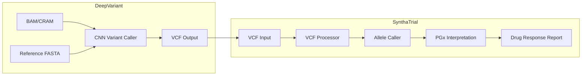

# DeepVariant vs SynthaTrial: Compatibility and Integration Analysis

> Analysis of Google's DeepVariant project in relation to SynthaTrial: pipeline position, similarities, differences, and integration opportunities for an end-to-end pharmacogenomics workflow.

## Executive Summary

**DeepVariant and SynthaTrial are complementary, not competing.** DeepVariant produces VCF files from raw sequencing reads; SynthaTrial consumes VCF files for pharmacogenomics interpretation. They operate at different stages of the genomics pipeline.

---

## Pipeline Position Comparison



| Stage | DeepVariant | SynthaTrial |
|-------|-------------|-------------|
| **Input** | BAM/CRAM + FASTA | VCF (pre-called variants) |
| **Process** | CNN-based genotype calling | rsID lookup, star-allele calling |
| **Output** | VCF (chr, pos, ref, alt, GT) | Patient profile, phenotype, drug recommendations |

---

## Similarities

1. **Genomics domain** — Both work with human genomic data for clinical/research use.
2. **VCF format** — DeepVariant outputs standard VCF; SynthaTrial parses standard VCF (`src/vcf_processor.py`).
3. **Reference genomes** — Both support GRCh37/hg19 and GRCh38/hg38.
4. **Open source** — DeepVariant (Apache 2.0) and SynthaTrial (MIT) are both open.
5. **Accuracy focus** — DeepVariant improves variant calling accuracy; SynthaTrial uses deterministic CPIC/PharmVar for phenotype accuracy.

---

## Key Differences

| Aspect | DeepVariant | SynthaTrial |
|--------|-------------|-------------|
| **Problem** | Variant calling (reads → genotypes) | Pharmacogenomics (variants → drug response) |
| **Method** | CNN on pileup images | Lookup tables (PharmVar/CPIC) |
| **Input** | Aligned reads | Called variants |
| **Scope** | Genome-wide SNPs/indels | Targeted PGx genes (CYP2D6, CYP2C19, etc.) |

---

## Can DeepVariant Help SynthaTrial?

### Yes — Integration Scenarios

**1. End-to-end pipeline for raw sequencing data**

If users have BAM/CRAM (e.g., WGS, targeted panels) instead of VCF:

```
BAM/CRAM → DeepVariant → VCF → SynthaTrial → PGx report
```

- SynthaTrial currently assumes VCFs from 1000 Genomes or clinical labs.
- Adding DeepVariant as an optional preprocessing step would support users with raw sequencing data.

**2. Higher-quality variant calls**

- DeepVariant often outperforms GATK for indels and difficult regions.
- Better variant calls → more reliable PGx allele calling.
- Relevant for genes like CYP2D6 (complex structure) and CYP2C19 (indels).

**3. New sequencing technologies**

- DeepVariant supports Illumina, PacBio HiFi, Oxford Nanopore.
- SynthaTrial could accept VCFs from long-read or hybrid workflows via DeepVariant.

**4. Alignment with ROADMAP gaps**

From [ROADMAP.md](../ROADMAP.md):

- **CYP2D6 CNVs** — DeepVariant can call some structural variants; SynthaTrial already parses SVTYPE (DEL/DUP) in VCF INFO.
- **Multi-variant haplotypes** — DeepVariant provides genotype calls; phasing would still need tools like WhatsHap or GLnexus.

---

## Technical Compatibility

| Requirement | DeepVariant Output | SynthaTrial Expectation |
|-------------|--------------------|-------------------------|
| Format | VCF 4.x | VCF 4.x (parsed in `parse_vcf_line`) |
| Chromosomes | chr1–chr22, chrX, chrY | Same (see `GENE_LOCATIONS_GRCH37`) |
| Genotypes | GT (0/0, 0/1, 1/1) | Same (`alt_dosage`, `_variants_to_genotype_map`) |
| rsIDs | Optional (dbSNP) | Preferred for PharmVar lookup |
| Structural variants | SVTYPE in INFO | Supported (`_parse_svtype`, CYP2D6 CNV) |

**rsID handling:** SynthaTrial relies on rsIDs for PharmVar lookup. DeepVariant VCFs may have rsIDs from dbSNP annotation; otherwise, chr:pos:ref:alt can be used with a liftover/annotation step (e.g., bcftools annotate, VEP).

---

## Integration Options

### Option A: Documentation-only (low effort)

- Document that SynthaTrial accepts VCFs produced by DeepVariant.
- Add a "Recommended variant callers" section (DeepVariant, GATK, bcftools).
- No code changes.

### Option B: Optional preprocessing script (medium effort)

- Add a script (e.g., `scripts/run_deepvariant.sh`) that:
  - Takes BAM/CRAM + reference.
  - Runs DeepVariant (Docker).
  - Outputs VCF for SynthaTrial.
- Useful for users with raw sequencing data.

### Option C: Full pipeline integration (higher effort)

- Integrate DeepVariant into AWS Step Functions or Lambda.
- Flow: S3 BAM → DeepVariant (e.g., Batch) → S3 VCF → SynthaTrial.
- Requires AWS Batch or similar for compute-heavy variant calling.

---

## Recommendation

- **Short term:** Option A — Document DeepVariant as a supported upstream variant caller.
- **Medium term:** Option B — Provide a convenience script for users with BAM/CRAM.
- **Long term:** Option C — If SynthaTrial targets clinical labs or WGS workflows, integrate DeepVariant into the cloud pipeline.

---

## Summary

| Question | Answer |
|----------|--------|
| **Similarities?** | Yes — genomics, VCF, open source, accuracy focus. |
| **Can it help?** | Yes — as an upstream variant caller for raw sequencing data. |
| **Replace SynthaTrial?** | No — different stages (variant calling vs PGx interpretation). |
| **Integration effort?** | Low (docs) to medium (script) to high (cloud pipeline). |
